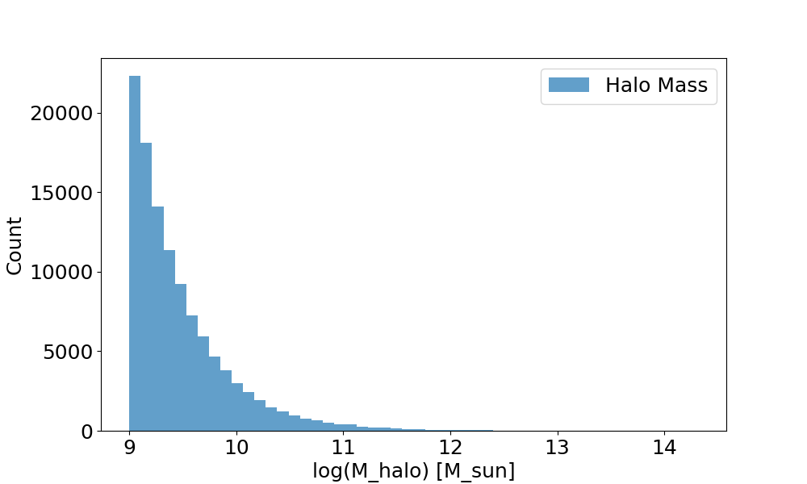
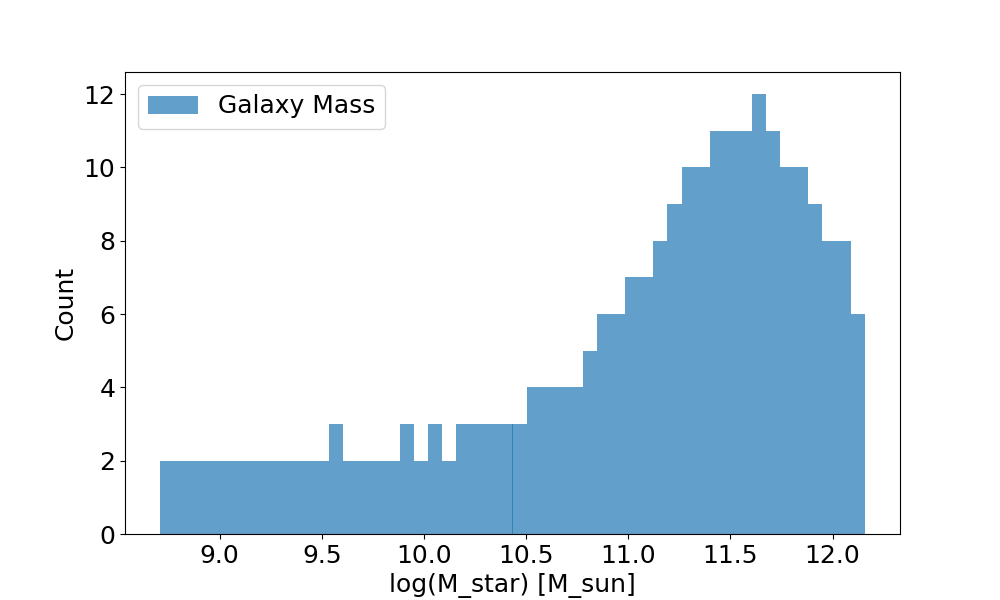

# HALOPROJ 

## Tasks
1. Use the hdf5 file with the halo and galaxy masses to perform abundance matching and plot
histograms of each mass
2. Use the distribution functions and bias code to calculate and plot the 2-point correlation
function (2PCF) of certain halo mass bins
3. Plot the 2PCF function for different galaxy mass bins
4. Plot the 2PCF for the same bin of galaxy mass but use different Stellar Mass Functions (SMF)
5. Repeat previous for 2 other mass bins, using different SMFs
6. Try with different HMF’s?
7. Change scatter value used in some of the calculations using different models, find which
values are optimal

## Plots 

